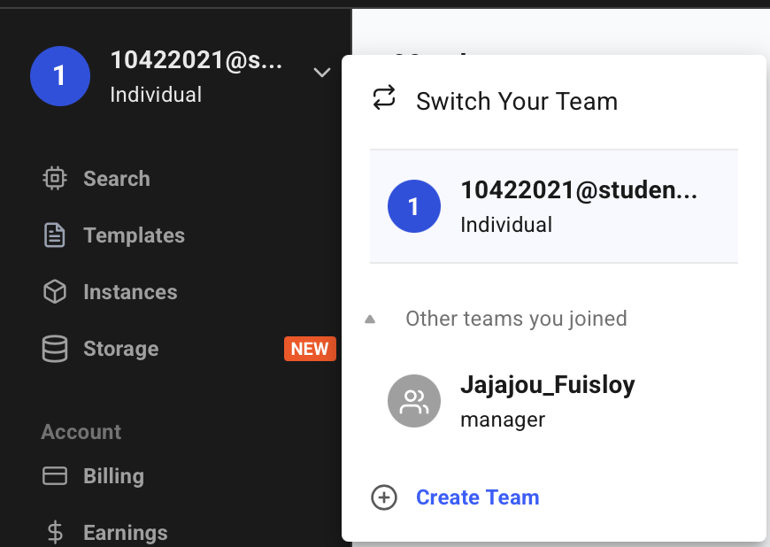
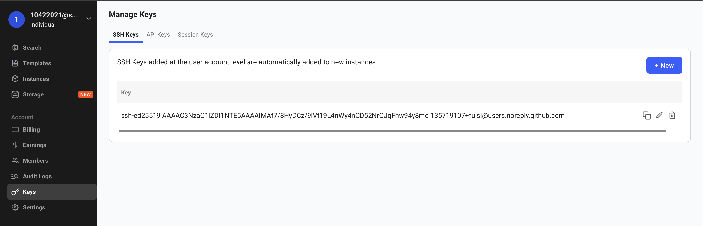
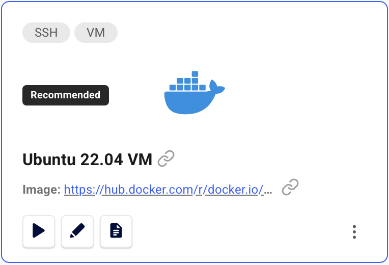
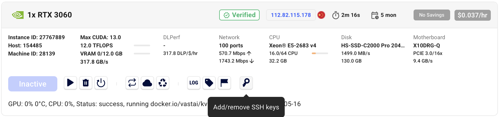
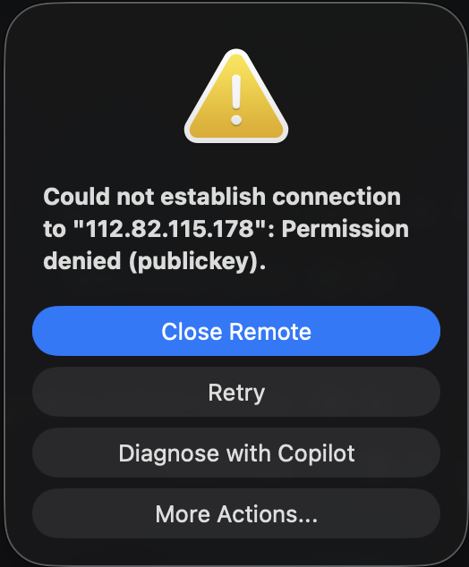
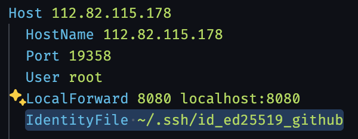

# Self host VLM with VastAI

## Prerequisite

1. VastAI account (join team)
2. SSH key pair

    ```bash
    ssh-keygen -t ed25519 -C "your_email@example.com"
    ```

3. Get **PUBLIC** key

    ```bash
    cat ~/.ssh/id_ed25519.pub
    ```

    > _In windows go to path at `C:\Users\YourUsername\.ssh\`_

4. Add SSH key to **PERSONAL** VastAI account

    1. Select personal account
    

    2. Go to "Keys" --> +New
    

    3. Paste public key and save **(PUBLIC KEY)**

## Select instance

1. Switch to team (to use team credits)
2. Go to "Templates" tab
3. Select template "Ubuntu 22.04 VM"
    
4. Select GPU instance (e.g. A100 40GB) and click "RENT"
5. Go to "Instances" tab and wait for instance to be ready
6. Click the key icon to copy the SSH command
    

7. SSH into the instance

    1. Terminal connect

        ```bash
        ssh -p 19349 root@112.82.115.178 -L 8080:localhost:8080
        ```

    > _If authentication fail, append `-i path-to-private-key` for specifying the private key (Identity file)_

    2. VSCode connect

        1. Open VSCode
        2. Install "Remote - SSH" extension
        3. Cmd+Shift+P `> Remote-SSH: Connect to Host...`
        4. Select `Add New SSH Host...`
        5. Paste the SSH command copied from VastAI (step 6)
        6. Select config file to save
        7. Connect to the host

        > _If authentication fail for custom public key_
        
        > _Manually add the IdentityFile with PRIVATE KEY path to the config file_
        

8. Clone vllm repo and open

    ```bash
    git clone https://github.com/fuisl/vllm-test.git
    cd vllm-test
    ```

    > _Change dir or use `code vllm-test` (if using VSCode) to open repo_

9. Setup environment

    ```bash
    cp .env.example .env
    ```

    > _Edit `.env` file to set your configurations (e.g. model name, port, etc). You need to provide only HuggingFace token for Gated Model._

10. Start VLM server

    ```bash
    docker-compose up
    ```

11. Port forwarding for local access

    > _If you used `-L 8002:localhost:8002` in SSH command, you can skip this step_

    1. I am assuming you are using VSCode Remote-SSH extension
    2. Cmd+Shift+P `> Forward a port` or click to PORTS tab at bottom panel
    3. Add port `8002`

12. Test VLM server

    Curl test

    ```bash
    curl -X POST "http://localhost:8002/v1/health"
    ```

    > _You should get `{"status":"ok"}` response_

13. Call model

    ```bash
    curl -X POST "http://localhost:8002/v1/chat/completions" \
    -H "Content-Type: application/json" \
    -d '{
        "model": "google/medgemma-4b-it",
        "messages": [{"role": "user", "content": "Hello, world!"}],
        "max_tokens": 50,
        "temperature": 0.7
    }'
    ```

    > _You should get model response_

14. Call api via app

    Base url should be `http://localhost:8002/v1`
    
